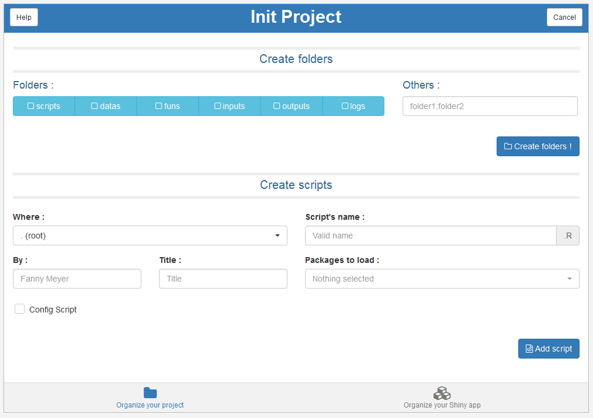

# addinit

> Addin for initializing new projects in RStudio

<!-- badges: start -->
[](https://www.tidyverse.org/lifecycle/#stable)
[](https://github.com/dreamRs/addinit/actions)
<!-- badges: end -->


## Overview

This addin provide a Shiny gadget to easily create directories and scripts from templates
in your new RStudio project !


Installation :
```r
# From Github
# install.packages("devtools")
devtools::install_github("dreamRs/addinit")
```


To launch the addin, use the addin menu in RStudio.




## Customization

You can customize a lot of options in addinit, for example the names
of the directories to create or a default author for the scripts.
For this just modify the parameters list below and
set the option addinit in your .Rprofile.


```r
my_custom_params <- list(
  author = NULL,
  project = list(
    folders = list(
      default = c("scripts", "datas", "funs", "inputs", "outputs", "logs"),
      selected = NULL
    ),
    packages = list(
      default = rownames(installed.packages()),
      selected = NULL
    ),
    config = TRUE,
    source_funs = FALSE
  ),
  application = list(
    folders = list(
      default = c("datas", "funs", "modules", "www"),
      selected = NULL
    ),
    packages = list(
      default = rownames(utils::installed.packages()),
      selected = NULL
    ),
    create_template = TRUE,
    template = "dashboard"
  )
)
options("addinit" = my_custom_params)
```


   
For examples, changing the author and the directories' names and select package `shiny` by default :

```r
my_custom_params <- list(
  author = "Victor",
  project = list(
    folders = list(
      default = c("R", "inst", "man", "data-raw", "data", "tests"),
      selected = c("R", "man")
    ),
    packages = list(
      default = rownames(utils::installed.packages()),
      selected = "shiny"
    )
  )
)
options("addinit" = my_custom_params)
```


   
<br>
   

### Full list of parameters :

| option            	| value            	| description                                                                                                                                           	|
|-------------------	|------------------	|-------------------------------------------------------------------------------------------------------------------------------------------------------	|
| author            	| character        	| The value to use by default for author input, used when creating a script from template                                                               	|
| folders.default   	| character vector 	| The names of the directories to create                                                                                                                	|
| folders.selected  	| character vector 	| Select folders to create by default                                                                                                                   	|
| packages.default  	| character vector 	| A vector of packages to load in scripts, by default all packages installed                                                                            	|
| packages.selected 	| character vector 	| Select packages to load by default                                                                                                                    	|
| config            	| logical          	| Add a config script or not at the root of the projects for loading data, sourcing funs,...                                                            	|
| source_funs       	| logical          	| Add code to source functions                                                                                                                          	|
| create_template   	| logical          	| Make Shiny template selection appear                                                                                                                  	|
| template          	| character        	| Template to create, `shiny` for a classic shiny app (ui, server, global), `dashboard` for use shinydashboard, `miniapp` for a single file app (app.R) 	|


